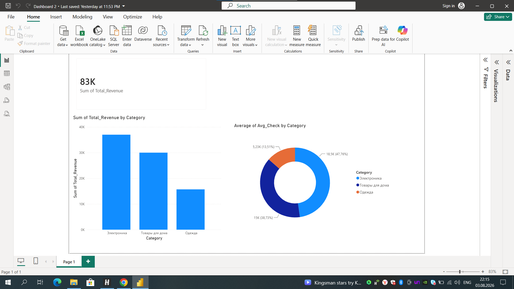

# 
�
�
 Sales & Revenue Analytics Dashboard (Power BI)
## 
�
�
 Project Overview
An interactive Power BI dashboard designed to analyze key sales metrics, revenue distribution
across product categories, and average order value (AOV).
## 
�
�
 Dashboard Preview

## 
�
�
 Key Insights & Metrics
* **Total Revenue:** ~$83K
* **Category Breakdown:** **Electronics** is the primary revenue driver, followed by **Home
Goods** and **Apparel**.
* **Average Check Analysis:** Electronics holds the largest share of the average order value
(~47.8%).
## 
�
�
 Tools & Technologies
* **Power BI Desktop** (Data Visualization, DAX, Power Query)
* **Excel / CSV** (Data Source)--
*Created as part of a data analytics portfolio.*
